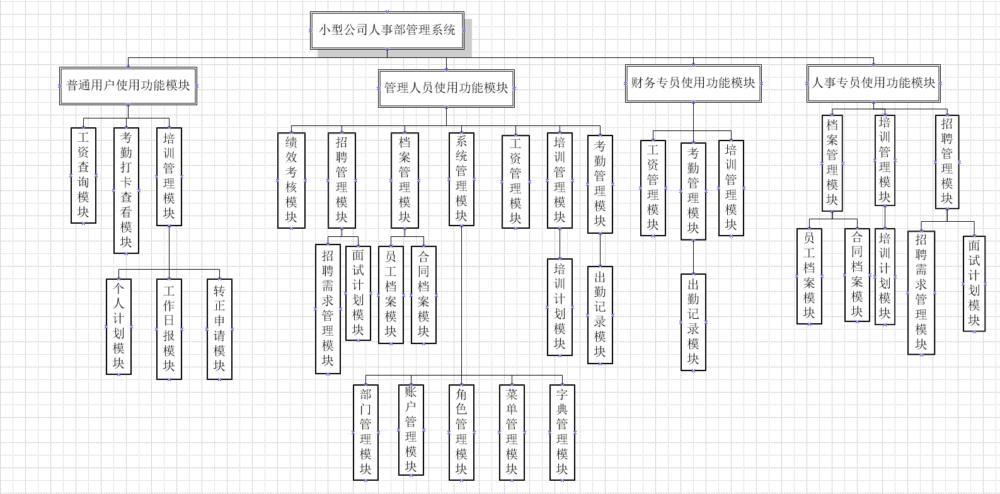

# 小型公司人事部管理系统功能描述

## 概览

### 主要模块组成

- 绩效考核
- 招聘管理
- 档案管理
- 工资管理
- 考勤管理
- 培训管理
- 系统管理

### 总体功能

- 满足小企业日常办公。本系统最大特色是有强大和灵活的权限控制功能，所有菜单，按钮功能均可由管理通过配置来控制。

### 角色组成

- 管理员: 可以操作所有功能
- 财务专员: 可查看工资管理，考勤管理，培训管理等内容
- 人事专员: 可查看和管理招聘管理，档案管理，培训管理等内容
- 普通用户: 只可查看工资，打卡考勤，参加培训等

### 模块图

## 普通员工使用功能模块

#### 详细模块组成

- **工资查询模块**: 员工可以查看自己工资记录。

- **考勤打卡查看模块**: 员工可以每日打卡、查看自己的出勤记录。

- **培训管理模块**
  - **个人计划模块**: 员工可写当日工作计划。
  - **工作日报模块**: 员工可写当日工作日报。
  - **转正申请模块**: 员工到了转正日期可申请转正由其领导进行审批。

## 管理人员使用功能模块

#### 详细模块组成

- **绩效考核模块**: 可以对权限范围内进行规定日期的年月考核量的数据录入、修改、删除和查询。

- **招聘管理模块**

  - **招聘需求模块**: 由人事部门或由招聘需求部门填写招聘需求。
  - **面试计划模块**: 人事专员看到各个部门的招聘需求后，联系候选人并和用人部门协商面试时间，并将面试计划提交，等面试结束再将面试结果同步到系统。招聘结束后结束流程。

- **档案管理模块**

  - **概览**: 权限范围内可进行对员工档案和合同档案的数据录入、修改、删除和查询。
  - **员工档案模块**: 人事部门添加员工档案。
  - **合同档案模块**: 公司商业合同管理。

- **工资管理模块**: 人事部门权限范围内可对员工工资信息的数据录入、修改、删除和查询。

- **考勤管理模块**

  - **出勤记录模块**: 人事部门权限范围内可对员工考勤信息的数据录入、修改、删除和查询。

- **培训管理模块**

  - **培训计划模块**: 人事部门权限范围内可对培训情况的数据录入、修改、删除和查询。

- **系统管理模块**

  - **账户管理模块**: 可为新员工增加系统登录账号，为离职员工删除账号。后期可扩展员工忘记密码后，重置密码功能，通常只有人事专员和管理员可用。

  - **部门管理模块**: 可增加新部门或新成立子公司，通常只有管理员和高级管理领导可用。

  - **角色管理模块**: 可新增角色，并为角色赋予相应权限，如招聘专员只能操作系统管理模块以外的其他模块功能，从财务专员只能进行工资记录添加等，通常只有管理员和高级管理领导可用。

  - **菜单管理模块**: 管理系统左侧的菜单树，只有管理员可用。

  - **字典管理模块**: 管理系统常用字典值，只有管理员可用。

## 财务专员使用功能模块

#### 详细模块组成

- **工资管理模块**: 普通用户可查看自己工资记录，财务专员可增加员工工资记录。人事部门权限范围内可对员工工资信息的数据录入、修改、删除和查询。

- **考勤管理模块**: 目前有出勤记录子模块。普通用户可每日打卡，查看出勤记录。权限范围内可对员工考勤信息的数据录入、修改、删除和查询。

## 人事专员使用功能模块

#### 详细模块组成

- **培训管理模块**

  - **个人计划模块**: 员工可写当日工作计划。
  - **工作日报模块**: 员工可写当日工作日报。
  - **转正申请模块**: 员工到了转正日期可申请转正由其领导进行审批。
  - **培训计划**: 可添加新员工培训计划，新技能培训计划，新业务培训计划，后期可扩展会议室管理功能。

- **档案管理模块**

  - **概览**: 权限范围内可进行对员工档案和合同档案的数据录入、修改、删除和查询。
  - **员工档案模块**: 人事部门添加员工档案。
  - **合同档案模块**: 公司商业合同管理。

- **招聘管理模块**

  - **招聘需求模块**: 由人事部门或由招聘需求部门填写招聘需求。
  - **面试计划模块**: 人事专员看到各个部门的招聘需求后，联系候选人并和用人部门协商面试时间，并将面试计划提交，等面试结束再将面试结果同步到系统。招聘结束后结束流程。
